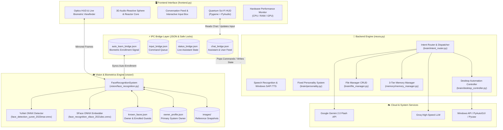

# ⚡ NEURA AI // Next-Gen Cognitive Desktop Assistant & Sci-Fi HUD

<div align="center">


[](https://www.python.org/)
[](https://www.pygame.org/)
[](https://opencv.org/)
[](https://ai.google.dev/)
[](https://groq.com/)
[](https://microsoft.com)
[](LICENSE)

<p align="center">
  <strong>An intelligent personal AI companion, cognitive assistant, and Iron Man / JARVIS-inspired cybernetic desktop HUD with deep biometrics (YuNet + SFace), 3D audio reactivity, computer vision, long-term memory, and OS automation.</strong>
</p>

[Key Features](#-key-features) • [Biometric Vision Pipeline](#-biometric-vision--facial-recognition-pipeline) • [Architecture](#-architecture) • [UI & HUD Showcase](#-ui--hud-showcase) • [Tech Stack](#-tech-stack) • [Directory Structure](#-project-directory-structure) • [Installation & Setup](#-installation--setup) • [Vision Enrollment Guide](#-face-enrollment--vision-tools) • [Command Cheatsheet](#-command-cheatsheet) • [Contact](#-developer--contact)

---

</div>

## 🌌 Overview

**Neura AI** is a state-of-the-art multimodal desktop companion engineered by **Rohit Kumar Adak**. Built with a deep focus on sci-fi aesthetics, conversational intelligence, deep facial biometrics, and native operating system automation, Neura bridges high-speed LLM reasoning (via **Google Gemini 2.0 Flash** & **Groq**) with direct desktop agency, deep computer vision, and a dynamic, audio-reactive cybernetic HUD.

Neura features an advanced **dual-model biometric pipeline** powered by OpenCV Zoo's **YuNet** (ultra-fast NMS face detection) and **SFace** (128-D cosine embedding feature extraction). Neura recognizes the system owner, identifies enrolled guests, auto-learns new persons on camera through natural voice dialogues, gracefully handles anonymity on refusal, and prioritizes greetings for known individuals over unknown prompts.

Whether commanded by **natural voice speech**, **tactical keyboard inputs**, or **visual presence**, Neura manages files, adjusts hardware brightness and volume, tracks real-time hardware telemetry, recalls long-term user preferences, and controls desktop workflows seamlessly.

---

## ⚡ Key Features

### 👁️ 1. Deep Biometric Vision & Facial Recognition (YuNet + SFace)
- **High-Speed Face Detection (YuNet)**: Real-time, lightweight ONNX detection yielding multi-face bounding boxes, confidence scores, and facial landmark coordinates.
- **Deep Feature Embedding (SFace)**: 128-dimensional L2-normalized embeddings mapped with cosine similarity thresholds for high-accuracy biometric verification.
- **Visual Identity Authentication & HUD Tagging**: Instant owner verification (*"Welcome back, Sir!"*), enrolled guest greeting, and mirrored camera optics with dynamic biometric targeting reticles.
- **Visual "Who Am I?" Queries**: Visual identification upon voice prompt (*"Who am I?"*), differentiating between the system owner, known friends/family, or unknown guests.
- **Autonomous Real-Time Learning**: When an unknown face enters the camera frame, Neura initiates an interactive conversational enrollment (*"Hello! Can you tell me your name?"*), automatically captures 5 multi-frame embeddings, writes an image snapshot, and registers them into the database.
- **Known-Face Prioritization**: If an unknown person is detected but a known person is also visible (or enters view), Neura **suppresses** the name prompt and prioritizes greeting the known person.
- **Anonymous Fallback Support**: If an unknown person replies with *"no"*, *"nope"*, *"nah"*, or any reluctance phrase, Neura automatically registers them sequentially as **`Anonymous 1`**, **`Anonymous 2`**, etc., with persistent photos and embeddings for future recognition.

### 🎙️ 2. Multimodal Interaction & Bi-Directional Bridge
- **Voice-Driven Interaction**: Hands-free voice commands powered by `SpeechRecognition` and native Windows SAPI / `pyttsx3` text-to-speech with natural pacing and asynchronous non-blocking speech queues.
- **Interactive In-HUD Text Input**: Blinking cursor input bar with clipboard support (`Ctrl+V`), command history, and instant dispatch for silent operation.
- **Multi-Process IPC Bridge**: Low-latency IPC bridges (`chat_bridge.json`, `input_bridge.json`, `status_bridge.json`, `auto_learn_bridge.json`) with safe atomic updates and file-lock collision guards.

### 🌐 3. Quantum Cybernetic HUD (Pygame 2.6 Engine)
- **3D Audio-Reactive Golden Sphere**: 1,800+ mathematically projected surface particles reacting in real-time to microphone acoustic amplitude.
- **Jarvis Arc Reactor HUD**: Rotating processor hexagon, sweeping radar lasers, orbital energy satellites, and expanding voice pulse rings.
- **24-Band Animated Spectrum Visualizer**: Real-time acoustic frequency equalizer bars styled with dynamic theme gradients.
- **Dynamic Theme Engine**: 4 instant colorways (**Orange/Gold**, **Neon Purple**, **Battle Red**, and **Bio Matrix Green**) switchable via in-app chips or hotkeys `1-4`.
- **Adaptive Layout Engine**: Fluid, responsive grid calculations preventing panel collisions on any display resolution from 720p to 4K.

### 🧠 4. 3-Tier Cognitive Memory Engine
- **Tier 1: User Identity & Facts**: Persists name, occupation, biometric presence state, and personal quirks across reboots.
- **Tier 2: User Preferences**: Retains explicit instructions (e.g., concise response style, preferred weather city, music choices).
- **Tier 3: Rolling Conversation Memory**: Summarizes conversation history, manages token windows, and logs episodic activity traces.
- **Memory Retention Index**: Live HUD meter scoring profile depth and memory density.

### 💻 5. Desktop Agency & Automation
- **System Telemetry Matrix**: Real-time live multi-line graphs tracking CPU load, RAM utilization, and NVIDIA GPU/VRAM metrics.
- **Hardware Controls**: Direct control of screen brightness (`screen_brightness_control`), master volume and mute states (`pycaw`), and media playback.
- **Vision Optics Module**: Live OpenCV webcam stream with sci-fi viewfinder overlays, target crosshairs, and animated radar sweep fallback.
- **Application & File Operations**: Fuzzy folder and file opening, web navigation, Wikipedia search with automatic Google fallback, and task manager integration.

---

## 👁️ Biometric Vision & Facial Recognition Pipeline

Neura's facial recognition subsystem operates on a multi-stage neural vision pipeline:

```
Camera Frame ──► Mirror Flip ──► YuNet ONNX (Face Detection & Landmarks)
                                         │
                                         ▼
                                 SFace ONNX (128-D Embeddings)
                                         │
                                         ▼
                               Cosine Metric Distance Matcher
                                         │
                 ┌───────────────────────┴────────────────────────┐
                 ▼                                                ▼
     Cosine Distance <= 0.363                         Cosine Distance > 0.363
                 │                                                │
         [KNOWN IDENTITY]                                 [UNKNOWN IDENTITY]
                 │                                                │
   ┌─────────────┴─────────────┐                        Known Face also in view?
   ▼                           ▼                                  │
[OWNER]                     [GUEST]                     ┌─────────┴─────────┐
Rohit Kumar Adak       Enrolled Name / Anon             ▼                   ▼
"Welcome back, Sir"    "Hello [Name], welcome"        [YES]                [NO]
                                                Greet Known Face     Prompt for Name:
                                                Suppress Prompt    "Can you tell me your name?"
                                                                            │
                                                                   ┌────────┴────────┐
                                                                   ▼                 ▼
                                                             User says Name    User says "No"
                                                                   │                 │
                                                             Enrolled Name     Next Anonymous
                                                            (e.g., "Pritam") (e.g., "Anonymous 1")
                                                                   │                 │
                                                                   └────────┬────────┘
                                                                            │
                                                                Capture 5 Frame Embeddings
                                                                Save Image Snapshot to disk
                                                                Update known_faces.json
```

### Face Matching Criteria
- **Detection Algorithm**: OpenCV Zoo YuNet (Input resolution dynamically scaled, score threshold: `0.70`, NMS threshold: `0.30`).
- **Feature Extractor**: OpenCV Zoo SFace (Output: 128-D float vector, L2 normalized).
- **Metric Comparison**: Cosine Distance = $1.0 - \text{CosineSimilarity}(\vec{e}_1, \vec{e}_2)$. Matches are classified when distance $\le 0.363$.
- **Known-Face Priority Ranking**:
  $$\text{Priority} = \begin{cases} 2 & \text{if Owner} \\ 1 & \text{if Enrolled Guest} \\ 0 & \text{if Unknown} \end{cases}$$
  Tiebreaker: Bounding box area ($w \times h$).

---

## 🏗️ Architecture

Neura decouples visual presentation from cognitive processing and vision inference using a synchronized multi-process architecture:



---

## 🎨 UI & HUD Showcase

| HUD Module | Description | Visual Highlights |
| :--- | :--- | :--- |
| **Top Cyber Header** | Central system status and operational dashboard | Live pulsing status badge (`READY`, `LISTENING`, `PROCESSING`, `SPEAKING`), live digital clock, instant theme selector chips, and `MIC`/`CAM`/`BOLD`/`CLR` toggles. |
| **Tactical Chat Feed** | Conversation stream & keyboard input | Formatted user bubbles (`YOU`) in cyan/blue glass and Neura responses (`NEURA`) in glowing theme accents with timestamps, smooth wheel scroll, and inline command input bar. |
| **Tactical Command Chips** | One-click action prompts | Instant action chips for `[JOKE]`, `[WEATHER]`, `[MEMORY]`, `[MUSIC]`, `[FILES]`, and `[TASKMGR]`. |
| **Quantum Reactor Core** | Audio-reactive visualizer | 3D mathematical dot sphere, rotating hexagon processor, cyan gap arcs, sweeping lasers, and radial reaction rays. |
| **Biometric Optics Viewfinder** | Camera & computer vision frame | Live camera feed with scanlines, corner brackets `[+]`, target lock crosshairs, identity HUD tags (Owner/Guest/Anonymous), confidence bar, and animated rotating radar sweep when in standby mode. |
| **Neural Memory Matrix** | Cognitive profile telemetry | User identity tag, biometric authentication status, activity logs, recent context snippet, and an animated gradient **Retention Index gauge**. |
| **Hardware Telemetry** | Task manager style live monitor | Cyber grid with neon green (CPU), purple (RAM), and amber (GPU/VRAM) real-time wave graphs. |

---

## 🛠️ Tech Stack

| Category | Technologies / Libraries |
| :--- | :--- |
| **Programming Language** | Python 3.10 / 3.11 / 3.12 |
| **Computer Vision & Biometrics** | OpenCV 4.x (`cv2`), YuNet ONNX, SFace ONNX, NumPy |
| **Graphical Interface** | Pygame 2.6, PyAudio |
| **LLM & AI Reasoning** | Google Gemini 2.0 Flash (`google-generativeai`), Groq API |
| **Speech & Audio** | `SpeechRecognition`, Windows SAPI5 (`win32com.client`), `pyttsx3`, PyAudio |
| **Hardware Monitoring** | `psutil`, NVIDIA SMI (`nvidia-smi`) |
| **OS Automation & Controls** | `pyautogui`, `pygetwindow`, `pycaw`, `screen_brightness_control`, `keyboard`, `webbrowser` |
| **Data & Memory** | JSON Schema Storage, 3-Tier Hierarchical Memory Model, SFace Vector Database |

---

## 📁 Project Directory Structure

```text
Neura_test_ai/
│
├── neura.py                 # Core AI assistant engine, speech recognition, intent router, execution loop
├── frontend.py              # Quantum Sci-Fi HUD, 3D sphere, biometric camera viewfinder, telemetry (Pygame)
├── setup_owner.py           # Primary owner enrollment CLI tool (camera or image folder)
├── setup_face.py            # Multi-person biometric enrollment, batch folder tool & CLI live learning
├── test_face_recognition.py # Diagnostic verification and test suite for the biometric pipeline
├── requirements.txt         # Project package dependencies
├── .env                     # Private API keys (Gemini, Groq)
│
├── chat_bridge.json         # IPC bridge: chat message stream
├── input_bridge.json        # IPC bridge: queued UI commands
├── status_bridge.json       # IPC bridge: live assistant state
├── auto_learn_bridge.json   # IPC bridge: unknown face auto-enrollment synchronization
│
├── vision/                  # Biometric Face Recognition subsystem
│   ├── __init__.py          # Vision module initialization
│   ├── face_recognition.py  # FaceRecognitionSystem class, YuNet & SFace models, metric matcher
│   ├── owner_profile.json   # Enrolled system owner identity and vector embeddings
│   ├── known_faces.json     # Multi-person enrolled face database (Owner, Guests, Anonymous)
│   └── models/              # Neural network ONNX model weights
│       ├── face_detection_yunet_2023mar.onnx
│       └── face_recognition_sface_2021dec.onnx
│
├── images/                  # Enrolled face snapshots (e.g., Rohit Kumar Adak.jpg, Anonymous 1.jpg)
│
├── brain/                   # Cognitive intelligence modules
│   ├── conversation.py      # LLM prompt orchestrator combining identity, memory, and chat history
│   ├── intent_router.py     # Intent classification engine mapping queries to desktop actions
│   ├── personality.py       # Neura's fixed personality guidelines, tone, and behavioral directives
│   ├── desktop_controller.py# Windows automation (volume, brightness, media, apps, screenshots)
│   └── file_manager.py      # File & folder discovery, fuzzy paths, and CRUD operations
│
├── memory/                  # 3-Tier persistent memory subsystem
│   ├── memory_manager.py    # MemoryManager class handling facts, preferences, and session context
│   ├── user_memory.json     # Long-term user profile, preferences, and episodic activity log
│   └── conversation_memory.json # Recent chat turns and summarized conversation memory
│
└── test_voice.py            # Diagnostic script for audio voice testing
```

---

## 🚀 Installation & Setup

### 1. Prerequisites
- **Operating System**: Windows 10 or Windows 11 (64-bit required for `pycaw`, SAPI5 TTS, and OpenCV DNN).
- **Python**: Python 3.10 to 3.12 installed ([python.org](https://www.python.org/downloads/)).
- **Microphone & Webcam**: Standard audio input and webcam for computer vision.

### 2. Clone the Repository
```bash
git clone https://github.com/rka2005/Nura-AI.git
cd Nura-AI
```

### 3. Create a Virtual Environment
```bash
python -m venv venv
venv\Scripts\activate
```

### 4. Install Dependencies
```bash
pip install -r requirements.txt
pip install opencv-python numpy groq screen-brightness-control pycaw keyboard pyautogui pyjokes psutil pyaudio
```

> **Note on PyAudio**: If you encounter issues installing `pyaudio` via pip on Windows, install it using `pip install pipwin && pipwin install pyaudio` or download the precompiled wheel from [Unofficial Windows Binaries](https://www.lfd.uci.edu/~gohlke/pythonlibs/#pyaudio).

### 5. Configure API Keys
Create a `.env` file in the root directory:
```env
GEMINI_API_KEY=your_google_gemini_api_key_here
GROQ_API_KEY=your_groq_api_key_here
```
- Obtain a Gemini key: [Google AI Studio](https://aistudio.google.com/)
- Obtain a Groq key: [Groq Console](https://console.groq.com/)

---

## 👤 Face Enrollment & Vision Tools

Neura provides dedicated CLI and runtime utilities for biometric face management:

### 1. Enrolling the Primary System Owner
Enroll the primary system owner using your webcam or reference photos:
```bash
# Guided interactive webcam capture (captures 5 samples)
python setup_owner.py --camera

# Or enroll using a folder with reference images
python setup_owner.py --folder "path/to/owner_photos"

# Specify a custom owner name (default: Rohit Kumar Adak)
python setup_owner.py --camera --name "Your Name"
```

### 2. Multi-Person Enrollment & Face Management
Manage guest faces or batch-enroll directories of individuals:
```bash
# Enroll a guest via guided webcam capture
python setup_face.py --camera --name "Alex"

# Batch enroll all photos in a folder (filename becomes the person's name)
python setup_face.py --folder "path/to/family_photos"

# List all enrolled faces, roles, sample counts, and timestamps
python setup_face.py --list

# Delete an enrolled person
python setup_face.py --delete "Alex"

# Launch CLI standalone live auto-recognition & learning mode
python setup_face.py --auto
```

### 3. Testing the Biometric Engine
Verify model loading, embedding consistency, and distance thresholds:
```bash
python test_face_recognition.py
```

---

## 🎮 Running Neura AI

### Launching the Complete System (HUD + AI Assistant + Biometrics)
Start the frontend interface:
```bash
python frontend.py
```
> `frontend.py` automatically initializes the camera, loads the YuNet + SFace biometric models, and supervises the `neura.py` daemon in the background.

### Running Headless / Voice-Only Mode
If you prefer running without the HUD GUI:
```bash
python neura.py
```

---

## ⌨️ Command Cheatsheet

Neura accepts commands via **Voice Speech**, **Typing into the HUD input box**, or **Visual Triggers**:

| Action Category | Example Commands / Triggers | Action Triggered |
| :--- | :--- | :--- |
| **Visual Identity** | *"Who am I?"* | Inspects camera stream; identifies Owner, Guest, or Unknown |
| **Biometric Presence** | *Owner steps in front of camera* | Authenticates identity and speaks personalized greeting |
| **Conversational AI** | *"Explain quantum computing in simple terms"* | Streams response via Gemini / Groq with memory context |
| **Media Control** | *"Play songs on YouTube"*, *"Pause media"*, *"Next track"* | Dispatches media keys or opens YouTube |
| **Volume Control** | *"Set volume to 60%"*, *"Mute volume"*, *"Unmute"* | Adjusts master Windows audio endpoints via `pycaw` |
| **Display Brightness** | *"Increase brightness"*, *"Set brightness to 80%"* | Modifies monitor brightness via WMI |
| **Search & Information** | *"Who is Elon Musk"*, *"Weather in Kolkata"*, *"Search Python docs"* | Wikipedia search (auto-falls back to Google) |
| **Cognitive Memory** | *"What do you know about me"*, *"My favorite city is Tokyo"* | Reads / writes to 3-tier memory engine |
| **Productivity & Notes** | *"Take a note"*, *"Read my notes"*, *"Set a reminder"* | Creates timestamped local notes & timers |
| **System Diagnostics** | *"Open task manager"*, *"Take a screenshot"* | Launches task manager or captures display |
| **Session Control** | *"Clear conversation"*, *"Clear memory"*, *"Goodbye"* | Resets memory buffers or cleanly shuts down |

---

## 🕹️ HUD Hotkeys & Shortcuts

- **`1`**: Switch to **Orange / Gold** Theme (Classic Core)
- **`2`**: Switch to **Neon Purple** Theme (Cyberpunk)
- **`3`**: Switch to **Battle Red** Theme (Combat Matrix)
- **`4`**: Switch to **Bio Matrix** Theme (Emerald Scanner)
- **`U`**: Toggle **Ultra-Bold** HUD Line Geometry
- **`Enter`**: Send typed command in the input box
- **`Esc`**: Clear current input box text
- **`Mouse Wheel`**: Scroll through chat history inside the conversation panel

---

## 👤 Developer & Contact

**Neura AI** is designed and actively developed by **Rohit Kumar Adak**.

- **Author**: Rohit Kumar Adak
- **Email**: [rohitadak0@gmail.com](mailto:rohitadak0@gmail.com)
- **Phone**: `+91 834875905`
- **GitHub**: [@rka2005](https://github.com/rka2005)
- **Repository**: [https://github.com/rka2005/Nura-AI](https://github.com/rka2005/Nura-AI)

---

## 📄 License

This project is licensed under the **MIT License** — see the [LICENSE](LICENSE) file for details.

<div align="center">
  <sub>Built with passion for next-generation Human-AI interaction.</sub>
</div>
