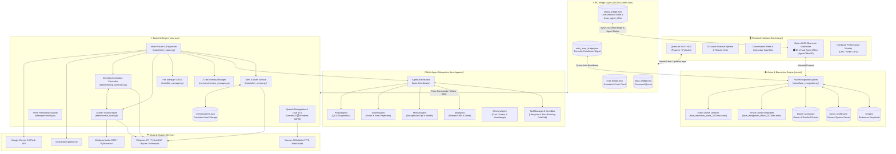

# ⚡ NEURA AI // Next-Gen Cognitive Desktop Assistant & Sci-Fi HUD

<div align="center">


[](https://www.python.org/)
[](https://www.pygame.org/)
[](https://opencv.org/)
[](https://ai.google.dev/)
[](https://groq.com/)
[](https://microsoft.com)
[](LICENSE)
[](brain/agents/)
[](frontend.py)
[](neura.py)
[](brain/alert_service.py)

<p align="center">
  <strong>An intelligent personal AI companion, multi-agent cognitive orchestrator, and a cybernetic desktop HUD with deep biometrics (YuNet + SFace), 3D Virtual Agent Office in Neura Optics, Screen Vision (OCR & semantic layout intelligence), Sarvam AI neural voice, intelligent alert offset engine, 3D audio reactivity, computer vision, long-term memory, and OS automation.</strong>
</p>

[Key Features](#-key-features) • [Alert & Alarm System](#-intelligent-alert-alarm--loophole-offset-subsystem) • [Biometric Vision Pipeline](#-biometric-vision--facial-recognition-pipeline) • [Screen Vision Subsystem](#-screen-vision--desktop-automation-subsystem) • [Architecture](#-architecture) • [UI & HUD Showcase](#-ui--hud-showcase) • [Tech Stack](#-tech-stack) • [Directory Structure](#-project-directory-structure) • [Installation & Setup](#-installation--setup) • [Vision Enrollment Guide](#-face-enrollment--vision-tools) • [Command Cheatsheet](#-command-cheatsheet) • [Contact](#-developer--contact)

---

</div>

## 🌌 Overview

**Neura AI** is a state-of-the-art multimodal desktop companion engineered by **Rohit Kumar Adak**. Built with a deep focus on sci-fi aesthetics, conversational intelligence, deep facial biometrics, and native operating system automation, Neura bridges high-speed LLM reasoning (via **Google Gemini 2.0 Flash** & **Groq**) with direct desktop agency, deep computer vision, and a dynamic, audio-reactive cybernetic HUD.

Neura incorporates a full **multi-agent personal AI architecture** where a central orchestrator coordinates four specialized autonomous agents (`ProjectAgent`, `ScreenAgent`, `MonitorAgent`, and `SkillAgent`), dividing complex tasks and supervising background jobs with non-intrusive proactive updates. The system features a real-time **3D Virtual Agent Office** rendered directly within the Neura Optics camera HUD, allowing users to watch agents physically travel along isometric conduit rails between the Central Hall and their department workstations in real time.

Neura features an advanced **dual-model biometric pipeline** powered by OpenCV Zoo's **YuNet** (ultra-fast NMS face detection) and **SFace** (128-D cosine embedding feature extraction). Neura recognizes the system owner, identifies enrolled guests, auto-learns new persons on camera through natural voice dialogues, gracefully handles anonymity on refusal, and prioritizes greetings for known individuals over unknown prompts.

Whether commanded by **natural voice speech**, **tactical keyboard inputs**, or **visual presence**, Neura manages files, adjusts hardware brightness and volume, tracks real-time hardware telemetry, recalls long-term user preferences, and controls desktop workflows seamlessly.

---

## ⚡ Key Features

### 👁️ 1. Deep Biometric Vision & Facial Recognition (YuNet + SFace)
- **High-Speed Face Detection (YuNet)**: Real-time, lightweight ONNX detection yielding multi-face bounding boxes, confidence scores, and facial landmark coordinates.
- **Deep Feature Embedding (SFace)**: 128-dimensional L2-normalized embeddings mapped with cosine similarity thresholds for high-accuracy biometric verification.
- **Visual Identity Authentication & HUD Tagging**: Instant owner verification (*"Welcome back, Sir!"*), enrolled guest greeting, and mirrored camera optics with dynamic biometric targeting reticles.
- **Visual "Who Am I?" Queries**: Visual identification upon voice prompt (*"Who am I?"*), differentiating between the system owner, known friends/family, or unknown guests.
- **Autonomous Real-Time Learning**: When an unknown face enters the camera frame, Neura initiates an interactive conversational enrollment (*"Hello! Can you tell me your name?"*), automatically captures 5 multi-frame embeddings, writes an image snapshot, and registers them into the database.
- **Known-Face Prioritization**: If an unknown person is detected but a known person is also visible (or enters view), Neura **suppresses** the name prompt and prioritizes greeting the known person.
- **Anonymous Fallback Support**: If an unknown person replies with *"no"*, *"nope"*, *"nah"*, or any reluctance phrase, Neura automatically registers them sequentially as **`Anonymous 1`**, **`Anonymous 2`**, etc., with persistent photos and embeddings for future recognition.

### 🎙️ 2. Multimodal Interaction & Bi-Directional Bridge
- **Sarvam AI Neural TTS Engine (`bulbul:v4-flash`)**: Studio-grade, natural neural speech generation powered by Sarvam AI's low-latency WebSocket streaming API. Employs the `ishita_enhi_companion` speaker profile (`en-IN` English, 24 kHz studio audio) for remarkably realistic, conversational voice inflection.
- **Fail-Safe Dual Voice Architecture**: Async WebSocket audio streaming with automatic fail-safe fallback to Windows SAPI5 (`pyttsx3`) local speech synthesis if offline or if API keys are missing.
- **Voice-Driven Interaction**: Hands-free voice recognition powered by `SpeechRecognition` with non-blocking speech queues and seamless frontend chat bridge integration.
- **Interactive In-HUD Text Input**: Blinking cursor input bar with clipboard support (`Ctrl+V`), command history, and instant dispatch for silent operation.
- **Multi-Process IPC Bridge**: Low-latency IPC bridges (`chat_bridge.json`, `input_bridge.json`, `status_bridge.json`, `auto_learn_bridge.json`) with safe atomic updates and file-lock collision guards.


### 🌐 3. Quantum Cybernetic HUD (Pygame 2.6 Engine)
- **3D Audio-Reactive Golden Sphere**: 1,800+ mathematically projected surface particles reacting in real-time to microphone acoustic amplitude.
- **Neura Arc Reactor HUD**: Rotating processor hexagon, sweeping radar lasers, orbital energy satellites, and expanding voice pulse rings.
- **24-Band Animated Spectrum Visualizer**: Real-time acoustic frequency equalizer bars styled with dynamic theme gradients.
- **Dynamic Theme Engine**: 4 instant colorways (**Orange/Gold**, **Neon Purple**, **Battle Red**, and **Bio Matrix Green**) switchable via in-app chips or hotkeys `1-4`.
- **Adaptive Layout Engine**: Fluid, responsive grid calculations preventing panel collisions on any display resolution from 720p to 4K.

### 🧠 4. 3-Tier Cognitive Memory Engine
- **Tier 1: User Identity & Facts**: Persists name, occupation, biometric presence state, and personal quirks across reboots.
- **Tier 2: User Preferences**: Retains explicit instructions (e.g., concise response style, preferred weather city, music choices).
- **Tier 3: Rolling Conversation Memory**: Summarizes conversation history, manages token windows, and logs episodic activity traces.
- **Memory Retention Index**: Live HUD meter scoring profile depth and memory density.

### 💻 5. Desktop Agency & File System CRUD
- **System Telemetry Matrix**: Real-time live multi-line graphs tracking CPU load, RAM utilization, and NVIDIA GPU/VRAM metrics.
- **Hardware Controls**: Direct control of screen brightness (`screen_brightness_control`), master volume and mute states (`pycaw`), and media playback.
- **Vision Optics Module**: Live OpenCV webcam stream with sci-fi viewfinder overlays, target crosshairs, and animated radar sweep fallback.
- **File System Operations**: Full CRUD file management (`create`, `read`, `update`, `delete`, `list`) and fuzzy folder/file discovery without external API calls.

### 👁️‍🗨️ 6. Screen Vision & Semantic Layout Intelligence (Zero Hardcoding)
- **Dynamic OCR & Multi-DPI Coordinate Translation**: Captures live desktop displays, extracts spatial text boxes via Windows Media OCR (`winocr`) with PyTesseract fallback, and dynamically scales pixel coordinates to logical mouse space (`screenshot_size / pyautogui.size()`) for pixel-perfect targeting on 100%, 125%, 150%, or 200% scaling.
- **Semantic Layout Understanding (Google & YouTube)**:
  - **Search Bars**: Automatically isolates the search input field in Google Search (`y ≈ 6-13%`) and YouTube (`y ≈ 3-9%`) with calibrated geometric fallbacks.
  - **Filter Tabs & Chips**: Dynamically identifies horizontal navigation tabs (`AI Mode`, `All`, `Images`, `Videos`, `News`, `Forums`, `Short videos`, `Tools`, `More` on Google; `All`, `Music`, `Podcasts`, `Mixes`, `Live` on YouTube) and left-sidebar navigation tabs (`Home`, `Shorts`, `Subscriptions`, `Library`).
  - **Clickable Link Titles vs. Description Snippets**: Distinctly separates the primary clickable headline (`<h3>` title) from descriptive paragraphs, breadcrumb URLs, bio lines, and metadata.
  - **Video Cards**: Isolates video titles from channel names, view counts, and timestamps.
- **Precision Title Scoring Algorithm**: Employs a multi-factor weighting algorithm that awards heavy bonuses for headline font sizes (`height >= 18px`), top card position, and 3-10 word lengths, while disqualifying brand badges, URLs, and heavily penalizing description markers (bullets `•`, `I'm a...`, `student`, `connections`, `followers`, `...`, `@gmail`).
- **Foreground Window Management**: Automatically activates and brings browsers (`Brave`, `Chrome`, `Edge`, `Firefox`) into focus prior to clicking target links.
- **Visual Screen Scene Summary**: Interrogates the active foreground application and describes visible UI landmarks and content cards upon voice request (*"What is currently open on my screen?"*).

### 🤖 7. Multi-Agent Personal AI Subsystem (Orchestrator & Specialized Agents)
- **Central Coordinator (`brain/agents/orchestrator.py`)**: `neura.py` serves as the primary controller delegating tasks to dedicated autonomous agents, synthesizing findings, and proactively informing the user without disrupting active workflows.
- **Specialized Agent Team (`brain/agents/`)**:
  - **`ProjectAgent` (QA & Diagnostics)**: Autonomous codebase auditor that validates project health, executes test runners, checks syntax trees, and isolates bugs.
  - **`ScreenAgent` (Vision & Inspection)**: Direct screen perception, visual exception detection in terminals, OCR layout understanding, and UI error tracking.
  - **`MonitorAgent` (Background Operations)**: Persistent non-intrusive supervisor watching background jobs, CPU spikes, RAM thresholds, and process lifecycles.
  - **`SkillAgent` (Domain Automation)**: Dynamic skill learner and executor that registers, verifies, and executes parameterized workflows safely.
  - **`ContextMemoryAgent` (Dual-Tier Context & Knowledge Archiving)**: Parallel supervisor that analyzes every user command, extracts context & feelings, manages `.agents/context_memory/` (`active_context.json`, `fixed_memory.json`, `temporary_memory.json`), enforces the 80% Context Similarity Protocol, and enables instant zero-API context recall.
- **Enterprise Task Engine (`TaskManager` & `EventBus`)**: Complete lifecycle state tracking (`PENDING`, `IN_PROGRESS`, `COMPLETED`, `FAILED`, `CANCELLED`), priority queuing, permission boundaries (`SAFE`, `CONFIRMATION_REQUIRED`, `ADMIN`), and throttled proactive announcements.

### 🏢 8. 3D Virtual Agent Office in Neura Optics (Real-Time Isometric Visualization)
- **In-Place Optics Viewport Switcher**: Directly renders within the **Neura Optics** camera panel at the top-right of the frontend HUD without altering the central sphere, HUD core, or audio spectrum.
- **Office Geometry & Departments**:
  - **Central Hall / Common Lounge**: Diamond platform at `(0, 0)` with a glowing holographic pedestal where `MEMORY_ARCHIVIST` (Royal Violet / Lavender) monitors real-time context streams and idle agents rest.
  - **QA Lab** (`(-68, -24)`): Dual holographic workstations for `PROJECT_TESTER` (Electric Cyan).
  - **Vision Lab** (`(24, -68)`): Optical sensor radar array for `SCREEN_VISION` (Neon Magenta).
  - **Ops Center** (`(-24, 68)`): Server rack towers with active status LEDs for `SYS_MONITOR` (Emerald Green).
  - **Tool Bay** (`(68, 24)`): Workbench matrix for `SKILL_RUNNER` (Amber / Gold).
- **Dynamic Movement & Work Animation**: Agents physically navigate along glowing isometric power conduits from the Central Hall to their department workstations when tasks are assigned (`IDLE` $\leftrightarrow$ `BUSY`), displaying floating status beacons, bobbing animations, and particle spark effects while working.
- **Dual Voice & GUI Toggles**:
  - Voice command *"show the 3d visualization of the agent works"* (or *"open 3d office"*, *"show agent visualization"*) instantly switches Neura Optics from camera feed to the 3D office.
  - Voice command *"close visualization"* (or *"close the visualization"*, *"show camera"*, *"switch to camera"*) smoothly closes the office and restores the live camera feed.
  - Interactive buttons: Direct header chip `[► 3D AGENTS]` / `[► CAM VIEW]`, top bar `[3D AGTS]` button, plus in-viewport `[DEMO]`, `[RESET]`, and agent click-to-inspect telemetry.

### ⏰ 9. Intelligent Alert, Alarm & Loophole Offset Subsystem
- **Natural Language Relative Offset Engine (Loophole Resolution)**: Automatically interprets and calculates conversational relative time offsets:
  - *"I have a meeting after 5 minutes, so alert me before 2 minutes of that"* $\rightarrow$ delay: $5 - 2 = 3$ minutes.
  - *"I have a meeting after 5 minutes, alert me after 3 minutes"* $\rightarrow$ delay: $3$ minutes.
  - *"I have a meeting in 10 minutes, alert me 3 minutes before that"* $\rightarrow$ delay: $10 - 3 = 7$ minutes.
  - Absolute clock time offsets: *"I have a meeting at 4:30 pm, alert me 15 minutes before"* $\rightarrow$ scheduled for 4:15 PM.
- **Context-Aware Spoken Announcements on Trigger**: Neura articulates the exact context of why the alert was scheduled and delivers a polite, humanized spoken announcement when it fires:
  - **Imminent Events**: *"Sir! You have an important meeting right now as you have told me. Please get ready for the meeting."*
  - **Offset Warnings**: *"Sir! As you told me, you have a meeting in 2 minutes. Please get ready for the meeting."*
  - **Action Reminders**: *"Sir! It is time to take your medicine right now as you have told me."*
  - **Direct Timers**: *"Sir! Your 5-minute alarm has arrived as you have told me."*
- **Multi-Sensor Alert Delivery**:
  - Pulsing multi-tone digital alarm chime (via Windows `winsound.Beep` sequence).
  - Neural voice announcement via Sarvam AI / Windows TTS.
  - Windows desktop toast notification.
  - Real-time logging into the frontend chat feed (`chat_bridge.json`) and status bar.
- **Persistent Background Daemon (`brain/alert_service.py`)**: Dedicated 0.5s daemon worker thread managing persistent alerts in `memory/alerts.json`, supporting active listing (*"What alarms are set?"*), targeted or full cancellation (*"Cancel the meeting alert"*, *"Cancel all alarms"*), and immediate silence commands (*"Stop alarm"*, *"Silence alarm"*).

---


## 👁️ Biometric Vision & Facial Recognition Pipeline

Neura's facial recognition subsystem operates on a multi-stage neural vision pipeline:

```
Camera Frame ──► Mirror Flip ──► YuNet ONNX (Face Detection & Landmarks)
                                         │
                                         ▼
                                 SFace ONNX (128-D Embeddings)
                                         │
                                         ▼
                               Cosine Metric Distance Matcher
                                         │
                 ┌───────────────────────┴────────────────────────┐
                 ▼                                                ▼
     Cosine Distance <= 0.363                         Cosine Distance > 0.363
                 │                                                │
         [KNOWN IDENTITY]                                 [UNKNOWN IDENTITY]
                 │                                                │
   ┌─────────────┴─────────────┐                        Known Face also in view?
   ▼                           ▼                                  │
[OWNER]                     [GUEST]                     ┌─────────┴─────────┐
Rohit Kumar Adak       Enrolled Name / Anon             ▼                   ▼
"Welcome back, Sir"    "Hello [Name], welcome"        [YES]                [NO]
                                                Greet Known Face     Prompt for Name:
                                                Suppress Prompt    "Can you tell me your name?"
                                                                            │
                                                                   ┌────────┴────────┐
                                                                   ▼                 ▼
                                                             User says Name    User says "No"
                                                                   │                 │
                                                             Enrolled Name     Next Anonymous
                                                            (e.g., "Pritam") (e.g., "Anonymous 1")
                                                                   │                 │
                                                                   └────────┬────────┘
                                                                            │
                                                                Capture 5 Frame Embeddings
                                                                Save Image Snapshot to disk
                                                                Update known_faces.json
```

### Face Matching Criteria
- **Detection Algorithm**: OpenCV Zoo YuNet (Input resolution dynamically scaled, score threshold: `0.70`, NMS threshold: `0.30`).
- **Feature Extractor**: OpenCV Zoo SFace (Output: 128-D float vector, L2 normalized).
- **Metric Comparison**: $\text{Cosine Distance} = 1.0 - \text{CosineSimilarity}(\vec{e}_1, \vec{e}_2)$ (matches classified when $\text{distance} \le 0.363$).
- **Known-Face Priority Ranking**:

$$
\text{Priority} =
\begin{cases}
2, & \text{if Owner} \\
1, & \text{if Enrolled Guest} \\
0, & \text{if Unknown}
\end{cases}
$$

- **Tiebreaker**: Bounding box area $(w \times h)$.

---

## 🖥️ Screen Vision & Desktop Automation Subsystem

Neura's **Screen Vision engine** (`brain/screen_vision.py`) equips the assistant with full visual understanding of what is actively visible on the user's desktop without hardcoded coordinates:

```
Screen Capture (Pillow/ImageGrab)
             │
             ▼
DPI Coordinate Scaling (Physical Screenshot Space ──► Logical Mouse Space)
             │
             ▼
Dual OCR Extraction (Windows Media OCR / PyTesseract Fallback)
             │
             ▼
Spatial Grouping & Semantic Classification
             │
   ┌─────────┴───────────────────────────────────────────┐
   ▼                                                     ▼
[Google Search Page]                             [YouTube Page]
 • Search Bar (y ≈ 6-13%)                         • Search Bar (y ≈ 3-9%)
 • Horizontal Filter Tabs (y ≈ 12-18%)            • Filter Chips (All, Music, etc.)
 • Vertical Content Cards                         • Left Navigation Tabs
   ├── Clickable Title (<h3>)                       • Video Cards
   └── Description Snippet (<div>)                    ├── Clickable Video Title
                                                      └── Metadata / Channel
             │
             ▼
Precision Title Scoring Engine
 (Heavily favors prominent headings; disqualifies URLs & penalizes description snippets)
             │
             ▼
DesktopController Action Execution (pyautogui / pygetwindow)
 • Bring browser to foreground
 • Move cursor with calibrated duration
 • Click, double-click, type, or scroll
```

### 1. Semantic Layout & UI Landmark Understanding

| UI Landmark | Google Search Layout | YouTube Layout | General Page Fallback |
| :--- | :--- | :--- | :--- |
| **Search Input Bar** | Centered top field (`y ≈ 6-13%`, `x ≈ 8-75%`). Calibrated fallback at `(35% w, 10% h)`. | Top center-left field (`y ≈ 3-9%`, `x ≈ 18-78%`). Calibrated fallback at `(45% w, 5.5% h)`. | Top field with `"search"`, `"find"`, or `"query"`. |
| **Filter Tabs & Chips** | `AI Mode`, `All`, `Images`, `Videos`, `News`, `Forums`, `Short videos`, `Tools`, `More` (`y ≈ 12-18%`). | Horizontal chips: `All`, `Music`, `Podcasts`, `Mixes`, `Live`, etc. (`y ≈ 7-15%`). | Horizontal nav elements near the top of the viewport. |
| **Navigation Tabs** | Browser chrome tabs & header options. | Left sidebar navigation: `Home`, `Shorts`, `Subscriptions`, `Library` (`x <= 15%`). | Sidebar and header navigation links. |
| **Content Cards** | Dynamic vertical clustering based on proportional edge-to-edge gap thresholds (`card_gap = 3.5% h`). | Video cards clustered with tighter vertical thresholds (`card_gap = 1.5% h`). | Vertical content groupings within `10% - 95%` screen height. |
| **Clickable Titles** | Blue/purple `<h3>` title link. Always prioritized over description text. | Primary video title text element in the card info column. | First prominent headline in the content card. |
| **Description Snippets** | Body summaries (`<div>`), bio strings, and snippet paragraphs below titles. | Video snippet text located below the channel name and view count metadata. | Body paragraph text located below headings. |

### 2. Precision Title Scoring Engine (Eliminating Description Misclicks)

When navigating web search results, clicking description snippets fails to open the target webpage because search engines only bind hyperlink events to the title heading. Neura's precision scoring evaluates every candidate element within each card:

$$
\text{Title Score} = \text{Base}(25) + S_{\text{pos}} + S_{\text{font}} + S_{\text{len}} - P_{\text{desc}} - P_{\text{brand}} - P_{\text{url}} - P_{\text{meta}}
$$

- **Positional Weight ($S_{\text{pos}}$)**: Titles are located at the top of cards ($+20$ for index $0$, $+15$ for index $1$, $-10 \times (\text{idx} - 1)$ for subsequent lines).
- **Font Height Differential ($S_{\text{font}}$)**: Larger headline font sizes receive $+25$ points ($\text{height} \ge 18\text{px}$ and card maximum), while small body text ($\le 15\text{px}$) is penalized $-15$.
- **Title Length Preference ($S_{\text{len}}$)**: Concise 3–10 word titles receive $+15$ points. Paragraph snippets ($\ge 14$ words) are heavily penalized ($-(w - 12) \times 3.0$).
- **Description Marker Penalties ($P_{\text{desc}}$)**: Elements containing bullets (`•`, `·`), bio phrases (*"I'm a..."*, *"student"*, *"connections"*, *"followers"*), ellipses (`...`, `…`), dates, or emails receive a severe $-35$ penalty.
- **Disqualifiers ($P_{\text{brand}}$, $P_{\text{url}}$, $P_{\text{meta}}$)**: Single-word brand titles (e.g. *"LinkedIn"*, *"Instagram"*), URL breadcrumbs (e.g. `site.com > in > ...`), and video metadata (*"views"*, *"ago"*) are penalized $-50$ and disqualified from title selection.

### 3. Desktop Automation Controller (`brain/desktop_controller.py`)

- **`click_link(description_or_index)`**: Focuses the browser window (`Brave`, `Chrome`, `Edge`, `Firefox`), dynamically resolves the requested link title (e.g. *"first link"*, *"second link"*, *"link about Python"*, or numerical index), and executes a smooth mouse click with calibrated fallbacks.
- **`screen_describe()`**: Captures the foreground window, counts structured UI elements, and speaks a natural summary of what is visible on the screen.
- **`screen_open_target(desc)` & `screen_click_target(desc)`**: Resolves dynamic visual targets (buttons, links, search bars, tabs, video titles) and triggers clicks.
- **`screen_scroll(direction)`**: Smoothly scrolls the active viewport up or down, and executes compound actions (*"scroll down and open the second result"*).
- **`screen_type(target, text)`**: Identifies target input fields on the screen and types requested strings.

---

## 🏗️ Architecture

Neura decouples visual presentation from cognitive processing and vision inference using a synchronized multi-process architecture:


```mermaid
flowchart TB
    subgraph UI_Layer ["🖥️ Frontend Interface (frontend.py)"]
        HUD["Quantum Sci-Fi HUD<br/>(Pygame + PyAudio)"]
        Sphere["3D Audio-Reactive Sphere & Reactor Core"]
        ChatUI["Conversation Feed & Interactive Input Box"]
        CamView["Optics HUD: Biometric Viewfinder<br/>⇄ 3D Virtual Agent Office (AgentOffice3D)"]
        Telemetry["Hardware Performance Monitor<br/>(CPU / RAM / GPU)"]
    end

    subgraph Vision_Subsystem ["👁️ Vision & Biometrics Engine (vision/)"]
        YuNet["YuNet ONNX Detector<br/>(face_detection_yunet_2023mar.onnx)"]
        SFace["SFace ONNX Embedder<br/>(face_recognition_sface_2021dec.onnx)"]
        BiometricCore["FaceRecognitionSystem<br/>(vision/face_recognition.py)"]
        KnownFacesDB[("known_faces.json<br/>Owner & Enrolled Guests")]
        OwnerProfile[("owner_profile.json<br/>Primary System Owner")]
        ImageStorage[("images/<br/>Reference Snapshots")]
    end

    subgraph Bridge_Layer ["⚡ IPC Bridge Layer (JSON & Safe Locks)"]
        ChatBridge[("chat_bridge.json<br/>Assistant & User Feed")]
        InputBridge[("input_bridge.json<br/>Command Queue")]
        StatusBridge[("status_bridge.json<br/>Live Assistant State & show_agent_office")]
        AutoLearnBridge[("auto_learn_bridge.json<br/>Biometric Enrollment Signal")]
    end

    subgraph Agent_Subsystem ["🤖 Multi-Agent Subsystem (brain/agents/)"]
        Orchestrator["AgentOrchestrator<br/>(Main Coordinator)"]
        ProjectAgent["ProjectAgent<br/>(QA & Diagnostics)"]
        ScreenAgent["ScreenAgent<br/>(Vision & Error Inspection)"]
        MonitorAgent["MonitorAgent<br/>(Background Ops & Health)"]
        SkillAgent["SkillAgent<br/>(Domain Skills & Tools)"]
        MemoryAgent["MemoryAgent<br/>(Dual Context & Knowledge)"]
        TaskManager["TaskManager & EventBus<br/>(Lifecycles & Non-Blocking Pub/Sub)"]
    end

    subgraph Core_Engine ["🧠 Backend Engine (neura.py)"]
        VoiceIO["Speech Recognition & Dual TTS<br/>(Sarvam AI ⇄ Windows SAPI5)"]
        Router["Intent Router & Dispatcher<br/>(brain/intent_router.py)"]
        AlertSvc["Alert & Alarm Service<br/>(brain/alert_service.py)"]
        Personality["Fixed Personality System<br/>(brain/personality.py)"]
        DesktopCtrl["Desktop Automation Controller<br/>(brain/desktop_controller.py)"]
        ScreenVision["Screen Vision Engine<br/>(brain/screen_vision.py)"]
        FileMgr["File Manager CRUD<br/>(brain/file_manager.py)"]
        MemoryMgr["3-Tier Memory Manager<br/>(memory/memory_manager.py)"]
        AlertsDB[("memory/alerts.json<br/>Persistent Alert Storage")]
    end

    subgraph External_APIs ["☁️ Cloud & System Services"]
        Sarvam["Sarvam AI Bulbul v4 TTS WebSocket"]
        Gemini["Google Gemini 2.0 Flash API"]
        Groq["Groq High-Speed LLM"]
        WinOCR["Windows Media OCR / PyTesseract"]
        WinOS["Windows API / PyAutoGUI / Pycaw / Winsound"]
    end

    CamView <--> |Mirrored Frames| BiometricCore
    BiometricCore --> YuNet & SFace
    BiometricCore <--> KnownFacesDB & OwnerProfile & ImageStorage
    HUD <--> |Reads Chat / Updates Input| Bridge_Layer
    Bridge_Layer <--> |Pops Commands / Writes State| Core_Engine
    StatusBridge <--> |Syncs 3D Office Mode & Agent States| CamView
    AutoLearnBridge <--> |Syncs Auto-Enrollment| BiometricCore
    Router --> Gemini & Groq
    Router --> DesktopCtrl & ScreenVision & FileMgr
    Router --> MemoryMgr
    Router --> Orchestrator
    Router --> AlertSvc
    AlertSvc <--> AlertsDB
    AlertSvc --> WinOS
    VoiceIO --> Sarvam
    Orchestrator --> ProjectAgent & ScreenAgent & MonitorAgent & SkillAgent
    Orchestrator <--> TaskManager
    DesktopCtrl <--> ScreenVision
    ScreenVision --> WinOCR
    ScreenVision --> WinOS
    DesktopCtrl --> WinOS
```

---

## 🎨 UI & HUD Showcase

| HUD Module | Description | Visual Highlights |
| :--- | :--- | :--- |
| **Top Cyber Header** | Central system status and operational dashboard | Live pulsing status badge (`READY`, `LISTENING`, `PROCESSING`, `SPEAKING`), live digital clock, instant theme selector chips, and `MIC`/`CAM`/`3D AGTS`/`BOLD`/`CLR` toggles. |
| **Tactical Chat Feed** | Conversation stream & keyboard input | Formatted user bubbles (`YOU`) in cyan/blue glass and Neura responses (`NEURA`) in glowing theme accents with timestamps, smooth wheel scroll, and inline command input bar. |
| **Tactical Command Chips** | One-click action prompts | Instant action chips for `[JOKE]`, `[WEATHER]`, `[MEMORY]`, `[MUSIC]`, `[FILES]`, and `[TASKMGR]`. |
| **Quantum Reactor Core** | Audio-reactive visualizer | 3D mathematical dot sphere, rotating hexagon processor, cyan gap arcs, sweeping lasers, and radial reaction rays. |
| **Neura Optics (Camera & 3D Agent Office)** | Dynamic dual-mode viewport (Live Scanner ⇄ 3D Agent Facility) | Live camera feed with biometric face tracking, or full 3D isometric Agent Office featuring Central Hall, 4 department rooms (QA Lab, Vision Lab, Ops Center, Tool Bay), animated agent navigation along power conduits (`IDLE` $\leftrightarrow$ `BUSY`), work particle FX, `[DEMO]` toggle, and 1-click view switching. |
| **Neural Memory Matrix** | Cognitive profile telemetry | User identity tag, biometric authentication status, activity logs, recent context snippet, and an animated gradient **Retention Index gauge**. |
| **Hardware Telemetry** | Task manager style live monitor | Cyber grid with neon green (CPU), purple (RAM), and amber (GPU/VRAM) real-time wave graphs. |

---

## 🛠️ Tech Stack

| Category | Technologies / Libraries |
| :--- | :--- |
| **Programming Language** | Python `3.11` (recommended) |
| **Computer Vision & Biometrics** | OpenCV 4.x (`cv2`), YuNet ONNX, SFace ONNX, NumPy |
| **Screen Vision & Desktop OCR** | Windows Media OCR (`winocr`), PyTesseract, Pillow (`PIL`), `ctypes` (Per-Monitor DPI v2) |
| **Graphical Interface** | Pygame 2.6, PyAudio |
| **LLM & AI Reasoning** | Google Gemini 2.0 Flash (`google-generativeai`), Groq API |
| **Speech & Audio** | Sarvam AI Neural TTS (`bulbul:v4-flash`, `ishita_enhi_companion`), `websockets`, Windows SAPI5 (`win32com.client`), `pyttsx3`, `SpeechRecognition`, PyAudio |
| **Alerts & Scheduling** | Autonomous Alert & Alarm Engine (`brain/alert_service.py`), Windows `winsound.Beep`, Native Windows Toast Notifications, Persistent 0.5s Daemon |
| **Hardware Monitoring** | `psutil`, NVIDIA SMI (`nvidia-smi`) |
| **OS Automation & Controls** | `pyautogui`, `pygetwindow`, `pycaw`, `screen_brightness_control`, `keyboard`, `webbrowser` |
| **Data & Memory** | JSON Schema Storage, 3-Tier Hierarchical Memory Model, SFace Vector Database, Persistent Alert Storage (`alerts.json`) |

---

## 📁 Project Directory Structure

```text
Neura_test_ai/
│
├── neura.py                     # Core AI assistant engine, speech recognition, Sarvam AI TTS, intent router, execution loop
├── frontend.py                  # Quantum Sci-Fi HUD, 3D sphere, biometric camera viewfinder, telemetry (Pygame)
├── setup_owner.py               # Primary owner enrollment CLI tool (camera or image folder)
├── setup_face.py                # Multi-person biometric enrollment, batch folder tool & CLI live learning
├── test_alert_system.py         # 16-test verification suite for relative offset alarms, loops, and contextual speech
├── test_screen_vision.py        # 14-test verification suite for Screen Vision, DPI scaling & cursor actions
├── test_semantic_screen_vision.py # Diagnostic layout tests for Google Search & YouTube UI landmarks
├── test_face_recognition.py     # Diagnostic verification and test suite for the biometric pipeline
├── test_agents_system.py        # Multi-agent verification suite (testing, monitoring, skills, errors)
├── requirements.txt             # Project package dependencies
├── .env                         # Private API keys (Gemini, Groq, Sarvam, Weather)
│
├── chat_bridge.json             # IPC bridge: chat message stream
├── input_bridge.json            # IPC bridge: queued UI commands
├── status_bridge.json           # IPC bridge: live assistant state & 3D office mode
├── auto_learn_bridge.json       # IPC bridge: unknown face auto-enrollment synchronization
│
├── vision/                      # Biometric Face Recognition subsystem
│   ├── __init__.py              # Vision module initialization
│   ├── face_recognition.py      # FaceRecognitionSystem class, YuNet & SFace models, metric matcher
│   ├── owner_profile.json       # Enrolled system owner identity and vector embeddings
│   ├── known_faces.json         # Multi-person enrolled face database (Owner, Guests, Anonymous)
│   └── models/                  # Neural network ONNX model weights
│       ├── face_detection_yunet_2023mar.onnx
│       └── face_recognition_sface_2021dec.onnx
│
├── images/                      # Enrolled face snapshots (e.g., Rohit Kumar Adak.jpg, Anonymous 1.jpg)
│
├── brain/                       # Cognitive intelligence modules
│   ├── alert_service.py         # Intelligent Alert & Alarm engine (relative offsets, math loophole resolution, audio chimes)
│   ├── conversation.py          # LLM prompt orchestrator combining identity, memory, and chat history
│   ├── intent_router.py         # Intent classification engine mapping queries to desktop actions
│   ├── personality.py           # Neura's fixed personality guidelines, tone, and behavioral directives
│   ├── screen_vision.py         # Screen Vision engine: OCR, DPI scaling, semantic layouts & title picker
│   ├── desktop_controller.py    # Desktop controller: browser window focus, link clicks, scrolling, typing
│   ├── file_manager.py          # File & folder discovery, fuzzy paths, and CRUD operations
│   └── agents/                  # Multi-Agent personal AI subsystem
│       ├── __init__.py          # Agent package exports & get_orchestrator singleton
│       ├── orchestrator.py      # AgentOrchestrator central coordinator & task delegator
│       ├── base_agent.py        # BaseAgent abstract class & lifecycle definitions
│       ├── project_agent.py     # ProjectAgent: automated testing & diagnostics
│       ├── screen_agent.py      # ScreenAgent: visual perception & terminal error inspection
│       ├── monitor_agent.py     # MonitorAgent: background process & system resource monitoring
│       ├── skill_agent.py       # SkillAgent: learned skills, automated pipelines & tool runner
│       ├── task_manager.py      # TaskManager: lifecycle state engine & priority queuing
│       └── events.py            # EventBus: non-blocking pub/sub messaging & notification queues
│
├── memory/                      # 3-Tier persistent memory subsystem
│   ├── alerts.json              # Persistent active and triggered alert/alarm storage
│   ├── memory_manager.py        # MemoryManager class handling facts, preferences, and session context
│   ├── user_memory.json         # Long-term user profile, preferences, and episodic activity log
│   └── conversation_memory.json # Recent chat turns and summarized conversation memory
│
└── test_voice.py                # Diagnostic script for audio voice testing
```

---

## 🚀 Installation & Setup

### 1. Prerequisites
- **Operating System**: Windows 10 or Windows 11 (64-bit required for `pycaw`, SAPI5 TTS, and OpenCV DNN).
- **Python**: Python 3.10 to 3.12 installed ([python.org](https://www.python.org/downloads/)).
- **Microphone & Webcam**: Standard audio input and webcam for computer vision.

### 2. Clone the Repository
```bash
git clone https://github.com/rka2005/Nura-AI.git
cd Nura-AI
```

### 3. Create a Virtual Environment
```bash
python -m venv venv
venv\Scripts\activate
```

### 4. Install Dependencies
```bash
pip install -r requirements.txt
pip install opencv-python numpy groq screen-brightness-control pycaw keyboard pyautogui pyjokes psutil pyaudio websockets pygame
```

> **Note on PyAudio**: If you encounter issues installing `pyaudio` via pip on Windows, install it using `pip install pipwin && pipwin install pyaudio` or download the precompiled wheel from [Unofficial Windows Binaries](https://www.lfd.uci.edu/~gohlke/pythonlibs/#pyaudio).

### 5. Configure API Keys
Create a `.env` file in the root directory:
```env
# AI Reasoning LLM Engines
GEMINI_API_KEY=your_google_gemini_api_key_here
GROQ_API_KEY=your_groq_api_key_here

# Real-Time Weather Telemetry
WEATHER_API=your_openweathermap_api_key_here

# Sarvam AI High-Definition Neural Speech (TTS)
SARVAM_API_KEY=your_sarvam_api_key_here
NEURA_TTS_PROVIDER=sarvam
NEURA_TTS_MODEL=bulbul:v4-flash
NEURA_TTS_LANGUAGE=en-IN
NEURA_TTS_SPEAKER=ishita_enhi_companion
```
- Obtain a Gemini key: [Google AI Studio](https://aistudio.google.com/)
- Obtain a Groq key: [Groq Console](https://console.groq.com/)
- Obtain a Sarvam AI key: [Sarvam AI Dashboard](https://dashboard.sarvam.ai/)
- Obtain a Weather key: [OpenWeatherMap API](https://openweathermap.org/api)


---

## 👤 Face Enrollment & Vision Tools

Neura provides dedicated CLI and runtime utilities for biometric face management:

### 1. Enrolling the Primary System Owner
Enroll the primary system owner using your webcam or reference photos:
```bash
# Guided interactive webcam capture (captures 5 samples)
python setup_owner.py --camera

# Or enroll using a folder with reference images
python setup_owner.py --folder "path/to/owner_photos"

# Specify a custom owner name (default: Rohit Kumar Adak)
python setup_owner.py --camera --name "Your Name"
```

### 2. Multi-Person Enrollment & Face Management
Manage guest faces or batch-enroll directories of individuals:
```bash
# Enroll a guest via guided webcam capture
python setup_face.py --camera --name "Alex"

# Batch enroll all photos in a folder (filename becomes the person's name)
python setup_face.py --folder "path/to/family_photos"

# List all enrolled faces, roles, sample counts, and timestamps
python setup_face.py --list

# Delete an enrolled person
python setup_face.py --delete "Alex"

# Launch CLI standalone live auto-recognition & learning mode
python setup_face.py --auto
```

### 3. Testing the Biometric Engine
Verify model loading, embedding consistency, and distance thresholds:
```bash
python test_face_recognition.py
```

### 4. Testing the Screen Vision & Desktop Subsystem
Run the 14-test verification suite covering screen capture, DPI scaling, OCR grouping, target selection, and safe cursor movements:
```bash
python test_screen_vision.py
```

Run dedicated semantic layout tests for Google Search (search bar, filter tabs, clickable link titles vs. descriptions) and YouTube (search bar, chips, nav tabs, video titles):
```bash
python test_semantic_screen_vision.py
```

### 5. Testing the Multi-Agent Orchestration Subsystem
Run the comprehensive test suite covering the `AgentOrchestrator`, `TaskManager` lifecycles, non-blocking `EventBus`, background monitoring, and agent delegation:
```bash
python test_agents_system.py
```

### 6. Testing the Intelligent Alert & Alarm Subsystem
Run the 16-test comprehensive suite covering relative offset math (loophole calculations), clock times, active listing, cancellation, and contextual trigger speech:
```bash
python test_alert_system.py
```


---

## 🎮 Running Neura AI

### Launching the Complete System (HUD + AI Assistant + Biometrics)
Start the frontend interface:
```bash
python frontend.py
```
> `frontend.py` automatically initializes the camera, loads the YuNet + SFace biometric models, and supervises the `neura.py` daemon in the background.

### Running Headless / Voice-Only Mode
If you prefer running without the HUD GUI:
```bash
python neura.py
```

---

## ⌨️ Command Cheatsheet

Neura accepts commands via **Voice Speech**, **Typing into the HUD input box**, or **Visual Triggers**:

| Action Category | Example Commands / Triggers | Action Triggered |
| :--- | :--- | :--- |
| **3D Agent Office (Show)** | *"Show the 3D visualization of the agent works"*, *"Show 3D visualization"*, *"Open 3D office"* | Switches Neura Optics panel to interactive 3D virtual office |
| **3D Agent Office (Close)** | *"Close visualization"*, *"Close the visualization"*, *"Close that one"*, *"Show camera"* | Closes 3D office and restores live camera feed in Neura Optics |
| **Project Codebase Testing** | *"Test my project"*, *"Run project tests"*, *"Inspect my project"* | ProjectAgent audits syntax, executes test runners, and reports health |
| **Project Failure Diagnosis** | *"Why did my project fail"*, *"Investigate failure"*, *"Debug project"* | ProjectAgent analyzes stack traces, error causes, and proposed fixes |
| **Agent Task Status** | *"What are you doing?"*, *"What tasks are running?"*, *"Agent status"* | Reports live status and active workloads across all agents |
| **Background Monitoring** | *"Start monitoring task Server"*, *"Stop monitoring"* | MonitorAgent tracks background jobs and resource health |
| **Screen Error Inspection** | *"Inspect screen for errors"*, *"Check screen errors"* | ScreenAgent scans screen for terminal tracebacks and compiler exceptions |
| **Skill Learning & Run** | *"Learn skill Deploy to run deploy.bat"*, *"Run skill Deploy"* | SkillAgent registers, validates, and runs automated skill workflows |
| **Screen Scene Vision** | *"What is currently open on my screen?"*, *"What's on my screen?"* | Analyzes active window, OCR elements, and summarizes visible UI landmarks |
| **Search Result Links** | *"Open the second Google search result"*, *"Click the first link"*, *"Click the 2nd link"* | Focuses browser and clicks the clickable link title (strictly excluding descriptions) |
| **Topic Link Opening** | *"Open the link about Python"*, *"Click link about YouTube"* | Identifies and clicks the link title matching the keyword on screen |
| **Filter Tabs & Chips** | *"Click images tab"*, *"Switch to videos tab"*, *"Open short videos tab"* | Locates horizontal filter chips/tabs (Google & YouTube) and clicks them |
| **Search Bar Focus** | *"Click the search bar"*, *"Focus search box"*, *"Search on active tab for AI"* | Clicks the search input bar or enters text into on-screen query fields |
| **Video & Song Playback** | *"Play the second song"*, *"Click the third video"*, *"Open first video"* | Detects visible video cards, identifies requested index, and opens media |
| **Viewport Scrolling** | *"Scroll down"*, *"Scroll down and open the third result"* | Scrolls viewport down/up, with optional compound target click execution |
| **Visual Identity** | *"Who am I?"* | Inspects camera stream; identifies Owner, Guest, or Unknown |
| **Biometric Presence** | *Owner steps in front of camera* | Authenticates identity and speaks personalized greeting |
| **Conversational AI** | *"Explain quantum computing in simple terms"* | Streams response via Gemini / Groq with memory context |
| **Media Control** | *"Play songs on YouTube"*, *"Pause media"*, *"Next track"* | Dispatches media keys or opens YouTube |
| **Volume Control** | *"Set volume to 60%"*, *"Mute volume"*, *"Unmute"* | Adjusts master Windows audio endpoints via `pycaw` |
| **Display Brightness** | *"Increase brightness"*, *"Set brightness to 80%"* | Modifies monitor brightness via WMI |
| **Search & Information** | *"Who is Elon Musk"*, *"Weather in Kolkata"*, *"Search Python docs"* | Wikipedia search (auto-falls back to Google) |
| **Cognitive Memory** | *"What do you know about me"*, *"My favorite city is Tokyo"* | Reads / writes to 3-tier memory engine |
| **File System CRUD** | *"Create file notes.txt with hello"*, *"Read file notes.txt"*, *"List files"* | Deterministic file operations via `FileManager` without API calls |
| **Productivity & Notes** | *"Take a note"*, *"Read my notes"*, *"Set a reminder"* | Creates timestamped local notes & timers |
| **Alert (Relative Offset)** | *"I have a meeting after 5 minutes, so alert me before 2 minutes of that"* | Calculates offset ($5-2=3$ minutes) and schedules alert for 3m from now |
| **Alert (Contextual Meeting)** | *"Neura please alert me after 5 minutes that I have an important meeting"* | Schedules 5m alert; speaks contextual meeting reminder on trigger |
| **Alert (Action Reminder)** | *"Set an alert after 10 minutes to take medicine"* | Sets 10m timer; speaks *"Sir! It is time to take your medicine..."* |
| **Alarm (Direct Timer)** | *"Set an alarm for 5 minutes"*, *"Alert me in 30 seconds"* | Schedules direct countdown timer with audio chime & toast |
| **Alarm (Clock Time)** | *"Set an alarm for 7:30 am"*, *"Alert me at 4:30 pm"* | Computes target clock time and schedules morning/afternoon alarm |
| **Active Alerts Query** | *"What alarms are set?"*, *"Show active alerts"*, *"Check my alarms"* | Lists pending alerts, target times, and remaining time |
| **Cancel Alerts** | *"Cancel the meeting alert"*, *"Cancel all alarms"* | Cancels specified alert by name or removes all active alerts |
| **Silence / Stop Alarm** | *"Stop alarm"*, *"Silence alarm"*, *"Turn off alarm"* | Immediately silences the continuous audio alarm chime |
| **System Diagnostics** | *"Open task manager"*, *"Take a screenshot"* | Launches task manager or captures display |
| **Session Control** | *"Clear conversation"*, *"Clear memory"*, *"Goodbye"* | Resets memory buffers or cleanly shuts down |

---

## 🕹️ HUD Hotkeys & Shortcuts

- **`1`**: Switch to **Orange / Gold** Theme (Classic Core)
- **`2`**: Switch to **Neon Purple** Theme (Cyberpunk)
- **`3`**: Switch to **Battle Red** Theme (Combat Matrix)
- **`4`**: Switch to **Bio Matrix** Theme (Emerald Scanner)
- **`U`**: Toggle **Ultra-Bold** HUD Line Geometry
- **`Enter`**: Send typed command in the input box
- **`Esc`**: Clear current input box text
- **`Mouse Wheel`**: Scroll through chat history inside the conversation panel

---

## 👤 Developer & Contact

**Neura AI** is designed and actively developed by **Rohit Kumar Adak**.

- **Author**: Rohit Kumar Adak
- **Email**: [rohitadak0@gmail.com](mailto:rohitadak0@gmail.com)
- **Phone**: `+91 834875905`
- **GitHub**: [@rka2005](https://github.com/rka2005)
- **Repository**: [https://github.com/rka2005/Nura-AI](https://github.com/rka2005/Nura-AI)

---

## 📄 License

This project is licensed under the **MIT License** — see the [LICENSE](LICENSE) file for details.

<div align="center">
  <sub>Built with passion for next-generation Human-AI interaction.</sub>
</div>
